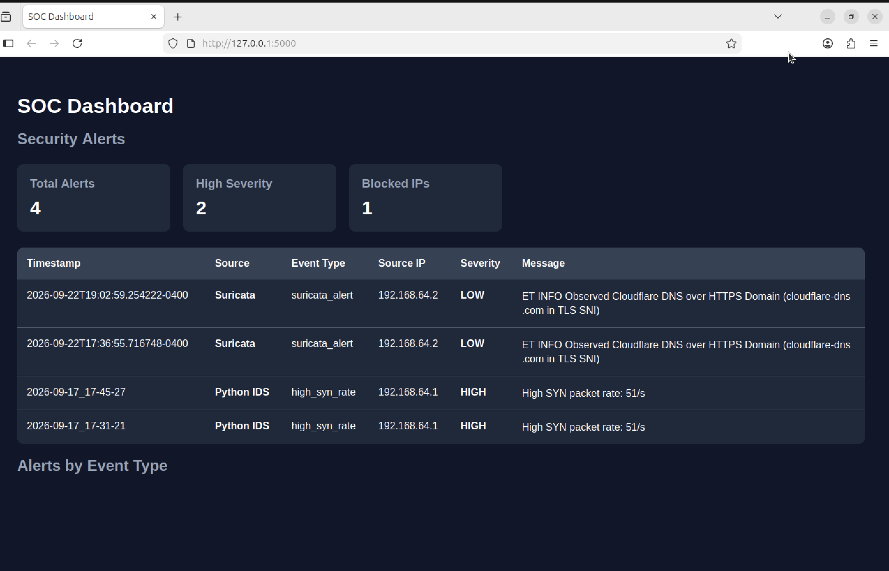

# Mini SOC IDS Dashboard

A cybersecurity project that combines a custom Python intrusion detection system with Suricata and a Flask-based SOC dashboard.
## Dashboard

## Features

- Network traffic monitoring with Scapy
- Port scan detection
- SYN-rate attack detection
- Automatic IP blocking with iptables
- Structured JSONL security logging
- Email alerts for high-severity events
- Suricata IDS integration
- Flask SOC dashboard
- Alert severity tracking and visualization

## Architecture

Mac / Test Traffic
        |
        v
Ubuntu VM
   |         |
Python IDS  Suricata
   |         |
 JSONL     eve.json
    \         /
     \       /
    Flask Dashboard
         |
     SOC Alert View

## Technologies

- Python
- Scapy
- Suricata
- Flask
- Chart.js
- Linux / Ubuntu
- iptables

## Installation

Install the Python dependencies:

```bash
pip install -r requirements.txt
```

Suricata must also be installed separately on the Linux system.

## Email Alerts

Credentials are stored using environment variables rather than directly in the source code.

```bash
export ALERT_EMAIL="your-email@example.com"
export EMAIL_APP_PASSWORD="your-app-password"
```

An optional separate recipient can be configured with `ALERT_EMAIL_TO`.

## Security

Passwords and credentials are not stored in the repository. Generated IDS logs, Suricata logs, virtual environments, and environment files are excluded through `.gitignore`.

## Status

Working prototype with custom IDS detection, automated blocking, Suricata integration, email alerts, and SOC dashboard visualization.
